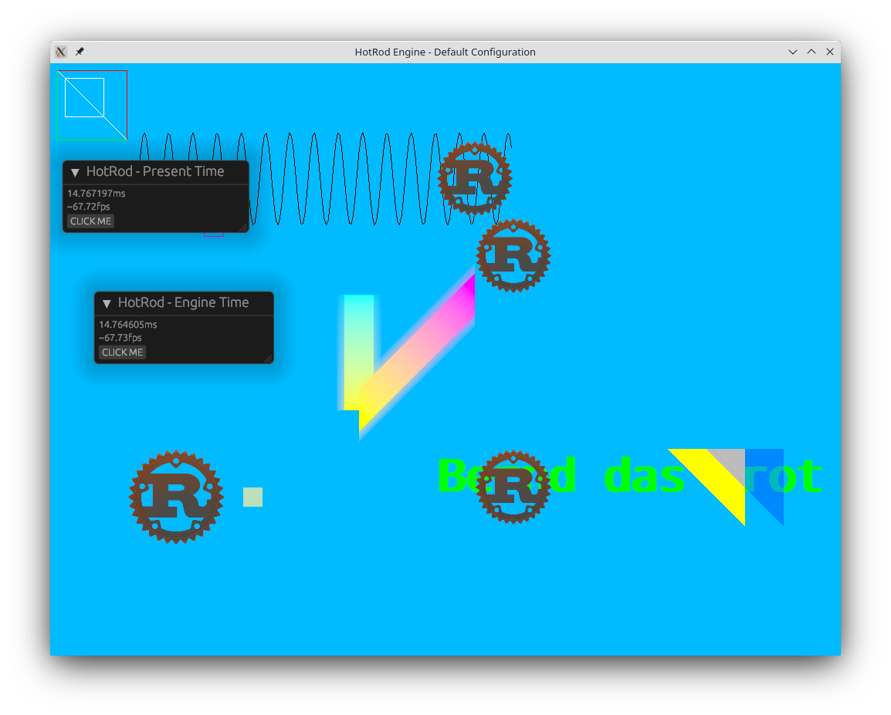

# HotRod Engine

My toy game engine written in Rust and Vulkan.
It uses [vulkano](https://crates.io/crates/vulkano) for the Vulkan bindings and [egui](https://crates.io/crates/egui) as UI framework.

